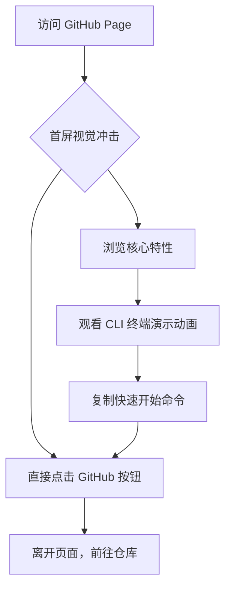

## 1. 产品概述
LiteAgent GitHub Page 是一个用于展示和推广 LiteAgent 框架的精美静态落地页。
- 作为 LiteAgent 开源项目的官方门户，向开发者展示其作为“轻量级 Agent Harness”的核心价值、技术栈优势以及使用场景。
- 帮助初学者快速了解如何安装、运行和扩展 LiteAgent，提升开源项目的专业度和影响力。

## 2. 核心功能

### 2.1 页面模块
1. **Hero 首屏区**: 极具科技感的标题、动态 Slogan（如 Typing 效果）、快速开始按钮（复制 npm 命令）、进入 GitHub 的链接。
2. **核心特性区**: 通过精美的卡片网格布局，展示“架构同源”、“开箱即用”、“极简学习”、“高扩展性”四大核心卖点。
3. **架构演示区**: 简单的代码片段或终端动效图展示（模拟 React Ink 的 CLI 界面），直观呈现 Agent 运行逻辑。
4. **快速开始区**: 分步指南，包含 npm 全局安装和 Bun 源码运行的命令展示。
5. **页脚区**: 版权信息、开源协议、GitHub 链接。

### 2.2 页面详细说明
| 页面名称 | 模块名称 | 功能描述 |
|-----------|-------------|---------------------|
| 落地页 | 首屏区 | 赛博朋克/极客风格背景，包含项目名称、副标题、核心操作按钮（Copy Install Command / View GitHub）。 |
| 落地页 | 特性展示区 | 使用 Hover 动效卡片展示项目的四大核心卖点，突出轻量化和易用性。 |
| 落地页 | 终端演示区 | 模拟 CLI 界面，动态展示 LiteAgent 启动向导和 `/mode` 切换功能，增强代入感。 |
| 落地页 | 代码指南区 | 提供深色模式的代码高亮块，展示安装和启动命令。 |

## 3. 核心流程
用户访问 GitHub Page -> 被首屏视觉吸引 -> 浏览核心特性和终端演示 -> 复制安装命令 -> 跳转至 GitHub 仓库获取详细信息。

## 4. 用户界面设计

### 4.1 设计风格
- **整体基调**: 极客风 (Geeky)、赛博朋克 (Cyberpunk) 融合极简主义 (Minimalist)。以暗色调为主，凸显终端开发工具的专业感。
- **主色调**: 深夜黑 (`#09090b`) 作为背景底色。
- **辅助色**: 赛博青 (`#06b6d4` Cyan) 和终端绿 (`#22c55e` Green) 作为高亮、按钮和光标颜色，呼应 LiteAgent CLI 中的色彩映射。
- **排版字体**: 标题使用极具几何感的无衬线字体（如 `Space Grotesk` 或 `Inter`），代码和终端演示部分严格使用等宽字体（如 `Fira Code` 或 `JetBrains Mono`）。
- **交互动效**: 页面滚动时元素的微透视浮现、卡片的霓虹边框发光 Hover 效果、终端区域的光标闪烁和打字机特效。

### 4.2 页面设计概览
| 页面名称 | 模块名称 | UI 元素 |
|-----------|-------------|-------------|
| 落地页 | Hero 区 | 全屏暗黑背景伴随青色渐变光晕，大号发光标题，打字机副标题，主按钮带霓虹发光边框。 |
| 落地页 | 特性卡片 | 毛玻璃质感 (Glassmorphism) 黑色卡片，鼠标悬停时青绿渐变边框高亮。 |
| 落地页 | 终端演示 | 仿 Mac/Windows 终端窗口，黑色底色，包含红黄绿三个窗口按钮，内部为等宽代码和绿色命令提示符。 |

### 4.3 响应式要求
- 采用 Desktop-first 设计理念，保证在宽屏显示器上的震撼视觉效果。
- 完美适配移动端设备，特性卡片在小屏幕上自动转为单列垂直排列，终端演示区等比例缩放，确保文本可读性。