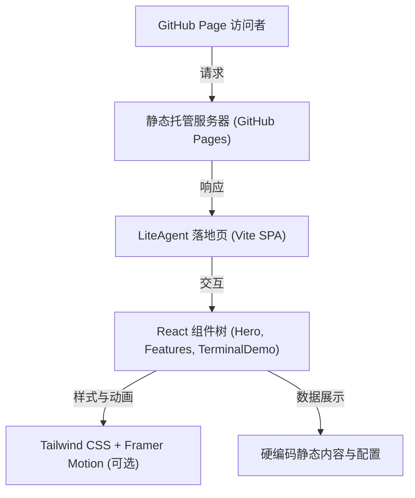

## 1. 架构设计



## 2. 技术描述
本项目是一个用于展示 LiteAgent 框架的静态单页应用（SPA）。考虑到其主要作为 GitHub Pages 托管，我们采用纯前端技术栈进行构建，不依赖任何后端服务。
- **前端框架**: React 18
- **构建工具**: Vite (极致的开发体验与打包速度)
- **样式解决方案**: Tailwind CSS v3 (实用类优先，支持快速实现暗黑模式和复杂渐变效果)
- **图标库**: Lucide React (简洁现代的矢量图标)
- **动画库**: Framer Motion (用于实现复杂的页面进入、卡片悬停和打字机等酷炫特效)
- **路由**: 不需要复杂路由，单页面锚点跳转即可。

## 3. 路由定义
作为单页面落地页，不引入 `react-router`，页面分为以下逻辑锚点区块：
| 锚点 ID | 页面区域 | 功能目的 |
|-------|---------|----------|
| `#hero` | 顶部主视觉区 | 吸引用户，展示品牌（Slogan、安装命令、GitHub 链接） |
| `#features` | 核心特性区 | 以卡片形式展示四大核心功能，体现项目轻量、易学的特性 |
| `#demo` | 终端演示区 | 动画模拟 CLI 运行过程（如启动向导、输入 API Key 和 /mode 命令） |
| `#install` | 快速开始区 | 详细的 npm / bun 安装指南，支持一键复制代码 |

## 4. API 定义
本项目为纯静态展示页，无后端交互需求，所有文案、命令和演示数据均在前端硬编码。

## 5. 部署策略
项目将被构建为静态文件，可以通过 GitHub Actions 自动部署到 `gh-pages` 分支，由 GitHub Pages 提供在线访问。Vite 配置文件需设置 `base` 为仓库名，例如 `/LiteAgent/`。

## 6. 数据模型
本页面无持久化数据模型，核心配置项（如演示终端的输出序列）将在 React 组件内部以常量数组形式维护：

### 6.1 终端演示状态序列
```typescript
interface TerminalLine {
  id: number;
  type: 'system' | 'user' | 'agent' | 'error';
  content: string;
  delay?: number; // 模拟打字/加载的延迟时间
}
// 例如：
// { type: 'agent', content: '🚀 Welcome to LiteAgent! Let\'s set up your agent.' }
// { type: 'user', content: 'https://api.openai.com/v1' }
```